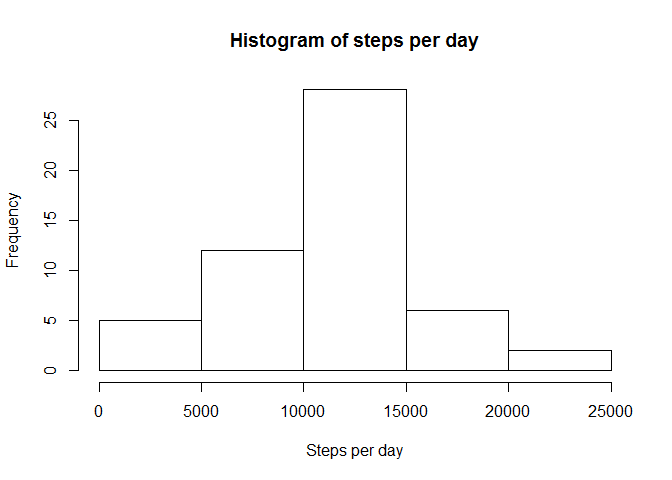
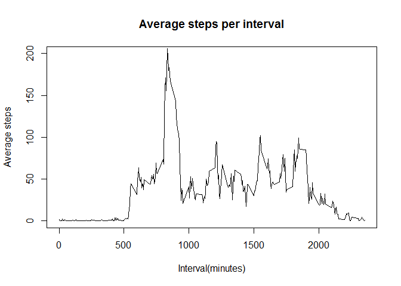
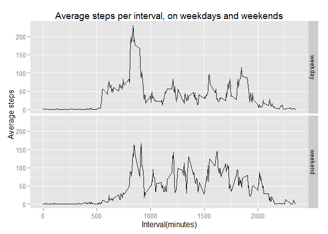

# Reproducible Research: Peer Assessment 1


## Loading and preprocessing the data

All the data used for this analysis is in the activity.csv file at https://d396qusza40orc.cloudfront.net/repdata%2Fdata%2Factivity.zip.  It is stored in a data frame with read.csv().  The dplyr and ggplot2 libraries are also loaded for later use.


```r
activity <- read.csv("activity.csv")
library(dplyr)
```

```
## Warning: package 'dplyr' was built under R version 3.1.3
```

```
## 
## Attaching package: 'dplyr'
## 
## The following object is masked from 'package:stats':
## 
##     filter
## 
## The following objects are masked from 'package:base':
## 
##     intersect, setdiff, setequal, union
```

```r
library(ggplot2)
```

```
## Warning: package 'ggplot2' was built under R version 3.1.3
```


## What is mean total number of steps taken per day?

The activity data frame is grouped by the date values, and the grouped data is summarised with the sum of steps to calculate the total step count for each date.  The sum values are stored in a new data frame.


```r
activity_days <- group_by(activity, date)
steps_per_day <- summarise(activity_days, total_steps = sum(steps))
```

A histogram of the total steps per day is generated.


```r
hist(steps_per_day$total_steps, xlab="Steps per day", main="Histogram of steps per day")
```

 

The mean and median values are calculated with the data frame containing the total step values.


```r
mean(steps_per_day$total_steps, na.rm=TRUE)
```

```
## [1] 10766.19
```

```r
median(steps_per_day$total_steps, na.rm=TRUE)
```

```
## [1] 10765
```


## What is the average daily activity pattern?

As before, a new data frame is generated by grouping the activity data and then calculating values for each grouping.  In this case, the values are grouped by interval and summarised with the mean value in each interval.


```r
activity_intervals <- group_by(activity, interval)
steps_per_interval <- summarise(activity_intervals, avg_steps = mean(steps, na.rm=TRUE))
```

The average step counts are plotted against the time values.


```r
plot(steps_per_interval$interval, steps_per_interval$avg_steps, 
    type="l", xlab="Interval(minutes)", ylab="Average steps", 
    main="Average steps per interval", ylim=c(0,200))
```

 

The interval value containing the maximum step count is then extracted.


```r
max_steps <- subset(steps_per_interval, steps_per_interval$avg_steps == max(steps_per_interval$avg_steps))
max_steps
```

```
## Source: local data frame [1 x 2]
## 
##   interval avg_steps
## 1      835  206.1698
```

## Imputing missing values

First, the number of rows with missing values in the data set is determined.


```r
na_rows <- subset(activity, is.na(activity)==TRUE)
nrow(na_rows)
```

```
## [1] 2304
```

A new data frame is generated with the missing step count values replaced by the average step count for their respective intervals. 


```r
filled_activity <- activity
for (i in 1:nrow(filled_activity))
    if(is.na(filled_activity$steps[i])==TRUE)
        filled_activity$steps[i]=subset(steps_per_interval, 
            steps_per_interval$interval == activity$interval[i])[1,2]
```

The new data frame is grouped and summarised to produce a total step count for each date.


```r
activity_days2 <- group_by(filled_activity, date)
steps_per_day2 <- summarise(activity_days2, total_steps = 
                    sum(as.numeric(as.character(steps))))
```

As before, the mean and median values of the total step counts are calculated, but on the new data frame with the missing values filled in.


```r
mean(steps_per_day2$total_steps)
```

```
## [1] 10766.19
```

```r
median(steps_per_day2$total_steps)
```

```
## [1] 10766.19
```

## Are there differences in activity patterns between weekdays and weekends?

A factor variable containing the levels "Weekday" and "weekend" is generated.


```r
day_type <- factor(c("weekday", "weekend"))
day <- c(1:nrow(filled_activity))
```

The factor values are then assigned to the data set based on the date values.


```r
for (i in 1:nrow(filled_activity)) {
    if(weekdays(as.Date(filled_activity$date[i])) == "Saturday" |
        weekdays(as.Date(filled_activity$date[i])) == "Sunday") {
        day[i] <- as.character(day_type[2])
    }
    else day[i] <- as.character(day_type[1])
}
filled_activity <- cbind(filled_activity, day)
```

The average steps in each interval are calculated in the same way as for finding the average daily activity pattern.  The average values are then plotted, with separate panels for intervals on weekdays and weekends.


```r
activity_intervals2 <- group_by(filled_activity, interval, day)
steps_per_interval2 <- summarise(activity_intervals2, 
                            avg_steps = mean(as.numeric(as.character(steps))))
g <- ggplot(steps_per_interval2, aes(interval, avg_steps))
g <- g + geom_line()
g <- g + ggtitle("Average steps per interval, on weekdays and weekends")
g <- g + xlab("Interval(minutes)") + ylab("Average steps")
g + facet_grid(day ~ .)
```

 

